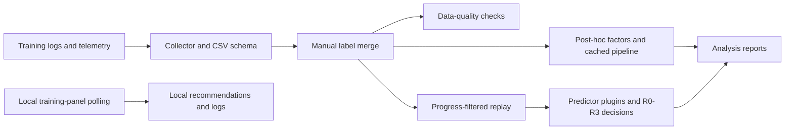

# RL Training Risk Replay & Quantitative Analysis

A quantitative research system for Go2W reinforcement-learning experiments, combining progress-filtered historical replay, configurable risk decisions, data-quality validation and cached time-series analysis.

**Domain:** robot training logs and resource telemetry. **Stack:** Python, pandas, NumPy, SciPy, scikit-learn, TensorBoard. **Quality:** 265 tests passed in the documented local run; full Pyright currently reports errors.

[中文说明](README.zh-CN.md) · [Validation and claim boundaries](docs/portfolio-validation.md)

## 1. Overview

Collect evaluation curves, TensorBoard scalars, resource snapshots and acceptance reports into structured CSVs. Explore failure signals, replay local recommendations and compare post-hoc baselines. The algorithmic focus is temporal visibility, rule-based decisions and reliable experimental data rather than dashboard UI.

This is training-run analysis, not a market-price, order-execution or trading-return backtester. Online replay implements partial visibility safeguards; it is **not yet end-to-end look-ahead safe**.

## 2. Key Results

| Verified fact | Evidence and scope |
|---|---|
| **265 tests passed** | Python 3.12.14 / macOS, 2026-09-12; no skips in this execution. See validation record. |
| **4 risk levels: R0–R3** | `factors.py`: configurable RiskItem accumulation and decision matrix. |
| **6 data-quality categories / 20+ checks** | Missingness, outliers, time continuity, duplicates, label consistency and cross-table integrity; `scripts/data_quality_check.py` and its tests. |
| **3 built-in replay predictors** | Rule engine, always-continue and always-stop; deterministic fixture tests in `tests/test_backtest_engine.py`. |

No numeric speedup or successful-sample false-kill claim is established by this verification. Structural counts are implemented capabilities, not predictive accuracy.

## 3. Why Look-ahead Bias Matters

A decision at time T must not see an experiment's eventual verdict or later telemetry. `online_view` truncates snapshots by time and eval/TensorBoard rows by observed progress, excludes reports and forces `completed=False`. Rolling training-set selection requires each selected run's estimated end time to precede the target start.

**Remaining boundary:** the view still copies the entire `runs` table, including final verdict/duration and unrelated future runs. End-time estimates and label availability are not tracked as-of T. The existing `test_no_time_leakage` checks training-set membership, not full predictor input isolation. These mechanisms therefore do not establish an end-to-end guarantee.

## 4. Architecture



Replay and post-hoc analysis have different information boundaries. Manual nonempty labels override automated fields by `(task, seed)`; duplicate or invalid labels raise errors.

## 5. Online Backtesting

- `backtest_rules.py`: snapshot-axis rule replay and estimated counterfactual training cost.
- `backtest_engine.py`: chronological target runs, eligible historical training runs and decision-progress checkpoints.
- Predictor interface: `(train_runs_info, target_online, cfg) -> {stop, confidence, reason}`.
- Outputs record skipped cases and end-time method (`actual`, `step_rate`, `task_mean`).

Rule confidence is derived from severity, not a calibrated probability. Lack of snapshots can exclude successful runs from rolling evaluation. The recorded run at progress 0.3/0.5 had four labeled failures and **no successful samples**; false-kill rate was N/A. Its apparent accuracy is unsuitable as a headline result.

## 6. Risk Engine

`run_factors` extracts reward drawdown, low-reward windows, KL/value-loss signals, stagnation, restarts and resource pressure. `run_risk_items` accumulates threshold-driven risk items; `decide` maps R0–R3 to `continue`, `watch`, `stop`, `tune` or `resize`.

These are local recommendations. The monitor does not send external notifications or automatically stop training. Exact rule count depends on whether factor codes, threshold branches or decision conditions are counted; this README does not claim “17 composable rules.”

## 7. Data Quality

The read-only checker emits Markdown/CSV and optional JSON issues. Six categories cover missingness, outliers, temporal continuity, duplicates, label consistency and integrity. Exit codes: 0 without critical issues, 1 with critical issues, 2 for runtime failures.

`data_screening.py` separately classifies experiment records as good, insufficient or anomalous using four screening rules. Validation functionality does not imply the committed dataset is issue-free.

## 8. Performance Optimization

`run_pipeline.py` loads tables once and passes DataFrames and a per-run factor cache between analysis stages. `tests/test_pipeline.py` checks cached/direct output equivalence and standalone/pipeline compatibility. Rule replay keeps its time-specific computation separate from full-run caching.

The CLI supports `--verbose` stage timings. No controlled baseline supports 97s→21s or 4.6×; a future benchmark must fix input commit, environment, stages and output-equivalence criteria.

## 9. Validation

Tests cover CSV collection and schema behavior, manual-label precedence, risk factors, chronological training selection, replay checkpoints, deterministic outputs, fold-local preprocessing, pipeline equivalence and failure-safe automation.

Full-run baselines use final acceptance information and are **post-hoc analyses**, not validated early-stop or ETA predictors. Leave-one-out preprocessing is fitted within each training fold; historical reports with older preprocessing must not be reused as current performance claims.

## 10. Quick Start

Offline analysis needs no training server. Python 3.12 is the current validation/CI target.

```bash
git clone https://github.com/Anhao1314/go2_lianghua.git
cd go2_lianghua
python -m venv .venv
source .venv/bin/activate
# Windows PowerShell: .venv\Scripts\Activate.ps1
python -m pip install -r requirements-dev.txt
python summary.py
python run_pipeline.py --today 2026-09-12 --out data/modeling/local_review --verbose
python backtest_engine.py --today 2026-09-12 --out data/modeling/local_replay --decision-progress 0.3,0.5,0.7
python -c "import shutil; shutil.copytree('data/datasets', 'data/quality/local_review/datasets', dirs_exist_ok=True)"
python scripts/data_quality_check.py --today 2026-09-12 --out data/quality/local_review --json
```

Output directories are separate from historical reports. `--today` labels outputs; it does not truncate input data. The quality checker uses the configured dataset and may legitimately report existing issues.

For collection, copy `config.example.json` to ignored `config.local.json` and specify the training source. Public defaults have no collection source. See [Chinese operational guide](README.zh-CN.md), [Windows guide](WINDOWS.md), [data dictionary](DATA_DICTIONARY.md) and [math definitions](MATH_LIBRARY.md). Do not run collection concurrently with analysis. Data-sync scripts can commit/push; they are not part of offline reproduction.

## 11. Tests & Quality

```bash
python -m pytest tests/ -q
python -m pyright --pythonpath .venv/bin/python --outputjson
```

On Windows use `.venv\Scripts\python.exe` for `--pythonpath`. Local verification: **265 passed**, **Pyright 1,645 errors / 0 warnings across 36 Python files**. Runtime requirements currently use lower bounds, not a fully locked environment.

GitHub Actions installs dependencies, gates on tests and runs full Pyright as an **advisory** check with an uploaded diagnostic report. A successful workflow does not mean type checking passed. There is no fabricated tests/CI badge. No license has been selected.

## 12. Limitations

- Predictor inputs are not fully isolated from final metadata; do not claim look-ahead-safe operation yet.
- Sparse/uneven labels and snapshot coverage limit false-positive, cross-task and sample-out validation.
- Snapshot duration measures observation span, not effective compute time; savings are counterfactual estimates, not realized cost reductions.
- CSV replacement is atomic per file, not a multi-table transaction; live collection and cross-platform collection are not validated by offline CI.
- Full Pyright has unresolved findings. Dependencies are not fully pinned.
- No production trading, live capital, return-rate, user/customer or autonomous early-stop claim.

Next priorities: as-of metadata and label availability, future-data mutation tests, type debt reduction, comparable benchmarks and multi-table publication consistency. [Research history](PHASE_RECORD.md) is historical context, not current performance evidence.
