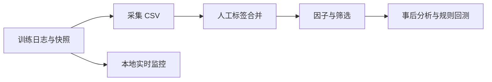

# go2w-quant：机器人训练实验数据采集与分析

采集 Go2w 强化学习训练日志，将评估曲线、TensorBoard、资源快照、验收结果与成本整理为 CSV，并提供因子分析、规则回放和本地监控。



## 离线快速开始

Python 3.10+；Windows 与 Linux 均可分析已提交样例，不需要连接训练端。

```bash
git clone https://github.com/Anhao1314/go2_lianghua.git
cd go2_lianghua
python -m venv .venv
# Linux/macOS
source .venv/bin/activate
# Windows PowerShell 使用 .venv\Scripts\Activate.ps1
pip install -r requirements.txt
python summary.py
python run_pipeline.py --today 2026-09-06 --out data/modeling/local_review
python baseline.py --dataset data/modeling/local_review/dataset_2026-09-06.csv --out data/modeling/local_review
```

`--today` 仅用于输出日期，不会截断输入数据。上述管线只读取已提交数据，输出到独立目录；不采集、不通知、不推送。Windows 入口见 [WINDOWS.md](WINDOWS.md)。

## 数据采集端

复制 `config.example.json` 为被忽略的 `config.local.json`，填写本机 `source_repo`，需要成本数据时填写 `lianghua_db`。无 `--config` 参数时优先读取本地配置，否则读取公开默认配置。公开默认配置没有采集源。

```bash
python collector.py
```

采集器只读训练源，写入本仓库数据目录。采集器对每个 CSV 原子替换，但多表仍非整批事务；读取与采集不应并发。`duration_seconds` 为快照观测跨度，不是有效计算时长。

## 本地监控端

```bash
python realtime_monitor.py --once
python realtime_monitor.py
```

默认读取 localhost:8787；在本地配置中调整训练面板地址。监控输出本地表格、风险建议与日志，不发送飞书消息，也不自动停止训练。ETA 是现有进度估算，不是已验证的预测模型。

## 分析边界

- 当前基线使用全程特征及最终验收信息，仅用于事后分析；不证明早停、ETA 或跨任务预测能力。
- 基线留一验证在每折训练样本内拟合填充与标准化；历史报告未重新计算，以新 `baseline_fold_safe_*` 报告为准。
- 有效标签与独立训练样本有限，缺失数据和负 R² 必须随结果说明。
- 规则回测为历史回放；实时与离线可用信息不同。

## 自动化与同步

安装定时任务前先手动验证采集和离线管线。每日任务采集失败即停止，管线成功才写日期标记，失败后下轮重试。

```bash
bash scripts/sync_github.sh --check
bash scripts/sync_github.sh --once
```

`--once` 会提交并推送数据，要求目标分支匹配、暂存区为空、没有非数据改动且远端未领先；冲突需人工处理。保留多表原子发布、run_id 与历史迁移为下一阶段工作。

## 文档与开发检查

[数据字典](DATA_DICTIONARY.md) · [数学定义](MATH_LIBRARY.md) · [路线图](QUANT_PLAN.md) · [开发约定](AGENTS.md)

```bash
pip install pytest
pytest tests/
```

当前仓库尚未明确开源许可证。
